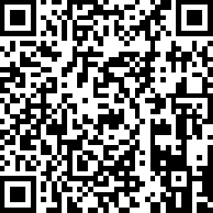

# Flagfilter

A modern, responsive web application for exploring and searching national flags from around the world. Built with HTML, CSS, and JavaScript, this application uses the Flagpedia API to display high-quality flag images.

## Features

- Grid display of national flags
- Real-time search functionality
- Color-based filtering
- Responsive design for all screen sizes
- Modern UI with smooth animations

## Usage

1. Open `index.html` in a web browser
2. Use the search bar to find flags by country name
3. Click on color filter buttons to filter flags by color
4. Hover over flag cards to see additional information

## Technical Details

- Uses the Flagpedia API for flag data and images
- Built with vanilla JavaScript (no frameworks)
- Responsive CSS Grid layout
- Modern CSS features for animations and transitions

## API Reference

The application uses the following Flagpedia API endpoints:
- `https://flagcdn.com/en/codes.json` - For flag data
- `https://flagcdn.com/w320/{code}.png` - For flag images

## Browser Support

The application works on all modern browsers that support:
- CSS Grid
- Flexbox
- ES6+ JavaScript features
- Fetch API

## Acknowledgments

- Special thanks to [flagpedia.net](https://flagpedia.net) for providing high-quality flag images and data
- Translation help is welcome! Join our translation project at [POEditor](https://poeditor.com/join/project/P7N0JxV3wI)

## Support

Donations are welcome to support the development and maintenance of this project:

Ethereum Address: `0xfe963F3d5346cEdC24A92BF217745E9c4854C17`

## License

This project is free software: you can redistribute it and/or modify it under the terms of the GNU General Public License as published by the Free Software Foundation, either version 3 of the License, or (at your option) any later version.

This program is distributed in the hope that it will be useful, but WITHOUT ANY WARRANTY; without even the implied warranty of MERCHANTABILITY or FITNESS FOR A PARTICULAR PURPOSE. See the GNU General Public License for more details.

You should have received a copy of the GNU General Public License along with this program. If not, see <https://www.gnu.org/licenses/>. 